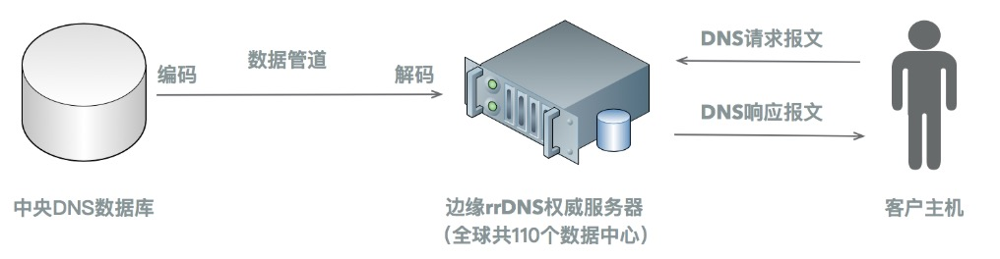

# Cloudfare的DNS加速技术和防攻击技术
## 1 简介
Cloudflare是一家位于美国的DNS服务商，历经6年发展，现已拥有超过六百万个域名空间，每秒处理的DNS查询请求达到一百万次
## 2 DNS系统架构
Cloudflare的权威DNS服务器是被称为rrDNS的定制服务器，Go语言编写，使用Key/Value存储方式。rrDNS具有模块化的框架，因此非常便于扩展，富有高度灵活性，容易添加应用逻辑来针对不同请求进行动态响应，以及加入类似DNSSEC的特性。

Cloudflare的DNS系统大体可以分为中央数据库、边缘权威服务器和数据管道（data pipeline）三个部分；中央数据库存储用户的DNS记录和原始服务器信息（origin server information），边缘权威服务器包括遍布全球的110个rrDNS数据中心，用于响应DNS查询请求。

当域名所有者操纵中央数据库的DNS记录发生改变时，数据管道会将变更后的数据发送给边缘的rrDNS数据中心；更具体地，数据管道会先编码中央数据库的DNS记录，以序列化成二进制数据进行传输，编码后的数据到达边缘rrDNS后，rrDNS再进行解码以反序列化成Go语言可用的格式。

## 3 DNS加速技术

Cloudflare在经过不断地技术更新后，使得rrDNS处理查询请求的速度提高了三倍，所使用的具体技术包括以下三点。

### 3.1 更新数据模型
根据DNS运行规则，用户在申请一次域名解析时，权威DNS服务器会返回多条资源记录（Resource Record,RR）。

在旧系统中，DNS存储在数据库中的方式是一条数据库记录对应一条资源记录（one entry per RR），这样就把RRSet打碎成了多条分散的RR记录（one key per RR），因此系统每处理一次DNS解析请求，需要对K/V数据库进行多次查询，从而产生了多次往返的报文交互。

在新系统中，数据模型是在数据库中把多条RR组织在一起，使得一次域名解析请求只需要访问一次K/V数据库。

### 3.2 更新序列化数据的方式

如第二节所介绍的，变更后的DNS记录从中央数据库分发到边缘的rrDNS时，需要先被编码以序列化成二进制数据，rrDNS收到数据后再解码成Go语言可用的结构类型。

在旧系统中，编码方式是混合使用JSON和Protocol Buffers，但Protocol Buffers对数据模式有比较严格的限制，这种限制导致原始zone数据（zone metadata）和RR只能被很粗略地编码，DNS协议本身的结构特点并没有被充分利用，造成了编码后数据的结构臃肿混乱，体积过大。

在新系统中，使用了MessagePack来序列化数据，相比Protocol Buffers，MessagePack对传输数据的模式要求更加自由灵活，限制更少，这样就可以很好的精简传输数据的格式，而且大大减少了编码后数据的体积。

### 3.3 重写rrDNS的过滤器

rrDNS具有模块化结构，所以工程师可以写不同的过滤器（filter）来响应DNS查询请求。

如3.1和3.2所述，由于所传输数据的模型和序列化数据的方式都被完全更改，所以工程师也把之前的过滤器进行了完全重写，这样不仅可以基于新的数据模型重新进行设计，还可以更好地适应Cloudflare现有的流量规模，以及拥有更高的测试覆盖率和更好的文档。

## 4 防攻击技术

### 4.1 速率限制
速率限制（rate limiting）可以对HTTP/HTTPS流量进行更加细粒度的控制，比如限制用户尝试登录的次数、当可疑访问次数超过事先设定的阈值时，可以触发超时和返回401-Unauthorized等特定响应。

因此，速率限制能够防护DDoS攻击，暴力登录尝试等针对应用层的攻击。
### 4.2 要求用户通过TCP发送DNS请求

DNS协议本身是运行于UDP之上的，使用53号端口，但由于Cloudflare的rrDNS具有高度灵活性，所以其工程师把rrDNS设定为要求客户端通过TCP发送DNS查询请求。

实现原理如图3所示，当客户端最开始发送基于UDP的DNS请求报文时，rrDNS会返回一个零字节的UDP响应报文，并置位相关标志位，这样客户端会通过TCP重新发起DNS查询请求；而TCP是需要经过三次握手确认的，所以基于TCP的DNS响应报文只会返回给被验证后的IP地址，这样就可以避免放大后的响应报文返回给被伪造的受害者IP地址，因此可以抵御反射放大攻击。

### 4.3  基于Anycast的分布式数据中心网络架构

物联网设备在飞速增加的同时，越来越多的摄像头，DVD等高带宽设备也被攻击者控制；典型地，以Mirai为代表的僵尸网络包含了超过30万台物联网设备，其最高攻击流量已达到了1Tbps。

利用越来越多的僵尸网络来发动DDoS攻击会对服务器产生越来越大的流量压力，Cloudflare认为，有效防御这种新形式DDoS攻击的根本方法是——使用非常庞大的分布式DNS服务器网络来实时监控、承担和封锁这些攻击流量；使用分布式架构的好处在于可以很便捷、低成本地进行横向扩展，而不需要购买更多更高性能的昂贵服务器。

为此，Cloudflare使用Anycast技术搭建了分布式的全球数据中心任播网络（global Anycast network of data centers），整个网络包含110个遍布世界各地的数据中心（如图2所示），其总流量吞吐率现已达到10 Tbps级别，比曾对Cloudflare实施过的最严重的DDoS攻击的流量还要多10倍。Anycast（任播）和单播、广播、多播并列，都是IP寻址和路由方式的一种；其原理为多台权威DNS服务器共享同一个IP地址，当一台客户主机往该共享地址发送请求报文时，报文会被自动路由到离该主机跳数最少的一台DNS服务器。

同时，Cloudflare认为负载均衡调节器（load balancer）等专用硬件有可能成为一场攻击中的单点缺陷，且扩展成本较高，因此Cloudflare选择使用BGP Anycast来实现软件形式的负载均衡。具体方式为每台服务器都使用Bird这款软件，来向数据中心的边界路由器声明通往自己的BGP路由路径，并对不同路径赋予不同权值，然后路由器再选择权值最低的一条路径作为优先路径；如果一台服务器宕机了，Bird会停止向路由器声明BGP路径，然后路由器重新选择当前环境下权值最低的作为更新后的优先路径。

而且Cloudflare的每一个机柜中的每一台服务器都能处理所有请求类型，这样在一场大型攻击中，流量负载就可以自动地均衡分布到成千上万台服务器上。 

