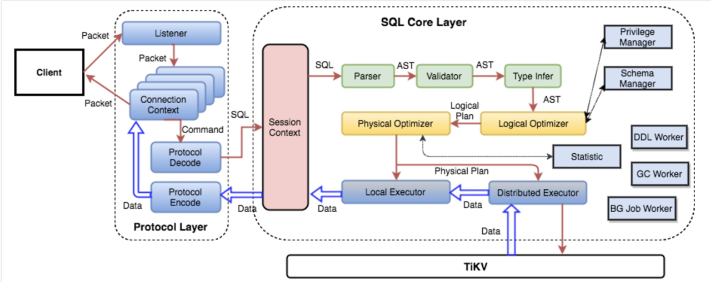

对于一个table来说，需要存储的数据有三类
	1. 表的元信息
	2. 表中的Row信息
	3. 索引数据
对于我们映射的KV底层是：
一个全局有序的分布式 Key-Value 引擎
基本原则：
TiDB 对每个表分配一个 TableID，每一个索引都会分配一个 IndexID，每一行分配一个 RowID（如果表有整数型的 Primary Key，那么会用 Primary Key 的值当做 RowID），其中 TableID 在整个集群内唯一，IndexID/RowID 在表内唯一，这些 ID 都是 int64 类型。
定义一些xxxPrefix这样的字符串常量，区分命名空间
## 1 关系型数据如何映射KV
基于上述基本原则中所定义的变量，映射关系如下：

```
Key： tablePrefix_rowPrefix_tableID_rowID
Value: [col1, col2, col3, col4]
```

以如下表存储为例：


```
”TiDB", "SQL Layer", 10
"TiKV", "KV Engine", 20
"PD", "Manager", 30
```

表中Row信息映射到KV存储为：

```
 t_r_10_1 --> ["TiDB", "SQL Layer", 10]
 t_r_10_2 --> ["TiKV", "KV Engine", 20]
 t_r_10_3 --> ["PD", "Manager", 30]
```

## 2 索引如何映射KV

唯一索引映射：
Key: tablePrefix_idxPrefix_tableID_indexID_indexColumnsValue
Value: rowID
普通索引映射：
 Key: tablePrefix_idxPrefix_tableID_indexID_ColumnsValue_rowID
 Value：null
同理，该表的index，假设这个index的ID为1，则其数据为：
```
 t_i_10_1_10_1 --> null
 t_i_10_1_20_2 --> null
 t_i_10_1_30_3 --> null
```
## 3 元信息如何映射KV
元信息简单理解就是和row和index类似，只是前缀不一致，用m前缀的key来代表，value存储序列化后的元信息，但是这中间还有些较多复杂的机制，比如说要定期检测online schema变更算法，有一个后台线程在不断的检查 TiKV 上面存储的 Schema 版本是否发生变化，并且保证在一定时间内一定能够获取版本的变化（如果确实发生了变化）
参考链接：[builddatabase/schema-change-implement.md at master · ngaut/builddatabase · GitHub](https://github.com/ngaut/builddatabase/blob/master/f1/schema-change-implement.md)
## 4 SQL运算

比如 Select count(1) from user where name="TiDB" 这样一个语句，我们需要读取表中所有的数据，然后检查 Name 字段是否是 TiDB，如果是的话，则返回这一行。
这样一个操作流程转换为 KV 操作流程：
	1. 构造出 Key Range：一个表中所有的 RowID 都在 [0, MaxInt64] 这个范围内，那么我们用 0 和 MaxInt64 根据 Row 的 Key 编码规则，就能构造出一个 [StartKey, EndKey] 的左闭右开区间
	2. 扫描 Key Range：根据上面构造出的 Key Range，读取 TiKV 中的数据
	3. 过滤数据：对于读到的每一行数据，计算 name="TiDB" 这个表达式，如果为真，则向上返回这一行，否则丢弃这一行数据
	4. 计算 Count：对符合要求的每一行，累计到 Count 值上面
这个方案肯定是可以 Work 的，但是并不能 Work 的很好，原因是显而易见的：
	- 在扫描数据的时候，每一行都要通过 KV 操作从 TiKV 中读取出来，至少有一次 RPC 开销，如果需要扫描的数据很多，那么这个开销会非常大
	- 并不是所有的行都有用，如果不满足条件，其实可以不读取出来
	- 符合要求的行的值并没有什么意义，实际上这里只需要有几行数据这个信息就行

## 5 分布式SQL运算
避免上述SQL运算部分提到的问题，宗旨是尽量避免大量的RPC调用，所以以下几点：
	1. 将计算尽量靠近存储节点
	2. 将Filter也下推到存储节点
	3. 将聚合函数、GroupBy 也下推到存储节点，进行预聚合，每个节点只需要返回一个 Count 值即可，再由 tidb-server 将 Count 值 Sum 起来

整体一个很很关键问题，如何在TiDB上SQL跑的很快？参见如下文章
[MPP and SMP in TiDB](https://mp.weixin.qq.com/s?__biz=MzI3NDIxNTQyOQ==&mid=2247484187&idx=1&sn=90a7ce3e6db7946ef0b7609a64e3b423&chksm=eb162471dc61ad679fc359100e2f3a15d64dd458446241bff2169403642e60a95731c6716841&scene=4)
## 6 TiDB-SQL层架构 



盗了参考链接中的图一张，较为直观的展现了整个sql的输入到解析到执行tikv的过程。
	1. 用户的 SQL 请求会直接或者通过 Load Balancer 发送到 tidb-server
	2. tidb-server 会解析 MySQL Protocol Packet，获取请求内容，然后做语法解析、查询计划制定和优化、执行查询计划获取和处理数据
	3. 数据全部存储在 TiKV 集群中，所以在这个过程中 tidb-server 需要和 tikv-server 交互，获取数据
	4. 最后 tidb-server 需要将查询结果返回给用户
## 7 学习链接
[三篇文章了解 TiDB 技术内幕：说计算 - 云+社区 - 腾讯云](https://cloud.tencent.com/developer/article/1005150)
## 8 几个思考的问题
TiDB既然主要是面向OLAP为啥底层还要key value
水平拆分的方式 hash 以及连续段 利弊？hash变更扩展成本高？
