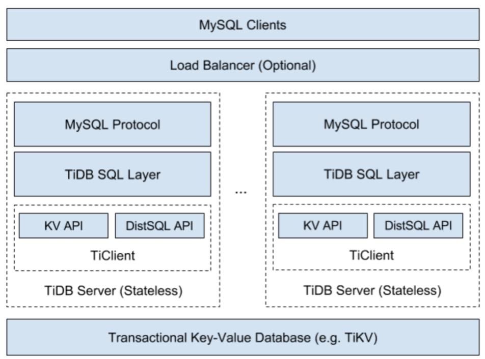

## 1 整体架构回顾

项目的 main 文件在 tidb-server/main.go
测试用例，可以在 xx_test.go 中找到

## 2 子模块说明
**ast**

抽象语法树的数据结构定义，例如 SelectStmt 定义了一条 Select 语句被解析成什么样的数据结构

**config**

配置文件相关逻辑

**context**

主要包括 Context 接口，提供一些基本的功能抽象，很多包以及函数都会依赖于这个接口，把这些功能抽象为接口是为了解决包之间的依赖关系

**ddl**

DDL的执行逻辑

**distsql**

对分布式计算接口的抽象，通过这个包把 Executor 和 TiKV Client 之间的逻辑做隔离

**domain**

domain 可以认为是一个存储空间的抽象，可以在其中创建数据库、创建表，不同的 domain 之间，可以存在相同名称的数据库，有点像 Name Space。一般来说单个 TiDB 实例只会创建一个 Domain 实例，其中会持有 information schema 信息、统计信息等。

**executor**

执行器相关逻辑，可以认为大部分语句的执行逻辑都在这里，比较杂，后面会专门介绍

**expression**

表达式相关逻辑，包括各种运算符、内建函数

**expression/aggregation**

聚合表达式相关的逻辑，比如 Sum、Count 等函数

**infoschema**

SQL 元信息管理模块，另外对于 Information Schema 的操作，都会访问这里

**kv**

KV 引擎接口以及一些公用方法，底层的存储引擎需要实现这个包中定义的接口

**meta**

利用 structure 包提供的功能，管理存储引擎中存储的 SQL 元信息，infoschema/DDL 利用这个模块访问或者修改 SQL 元信息

**meta/autoid**

用于生成全局唯一自增 ID 的模块

**metrics**

Metrics 相关信息，所有的模块的 Metrics 信息都在这里

**model**

SQL 元信息数据结构，包括 DBInfo / TableInfo / ColumnInfo / IndexInfo 等

**mysql**

MySQL 相关的常量定义

**owner**

TiDB 集群中的一些任务只能有一个实例执行，比如异步 Schema 变更，这个模块用于多个 tidb-server 之间协调产生一个任务执行者。每种任务都会产生自己的执行者

**parse**

语法解析模块，主要包括词法解析 (lexer.go) 和语法解析 (parser.y)，这个包对外的主要接口是 Parse()，用于将 SQL 文本解析成 AST

**parser/goyacc**

对 GoYacc 的包装

**parser/opcode**

关于操作符的一些常量定义

**perfschema**

Performance Schema 相关的功能，默认不会启用

**plan**

查询优化相关的逻辑

**privilege**

用户权限管理接口

**privilege/privileges**

用户权限管理功能实现

**server**

MySQL 协议以及 Session 管理相关逻辑

**statistics**

统计信息模块

**store/tikv**

TiKV 的 Go 语言 Client

**table**

对 SQL 的 Table 的抽象

**tablecodec**

SQL 到 Key-Value 的编解码，每种数据类型的具体编解码方案见 codec 包

**tidb-server**

服务的 main 方法

**types**

所有和类型相关的逻辑，包括一些类型的定义、对类型的操作等

## 3 github地址
[TiDB 源码阅读系列文章（二）初识 TiDB 源码 - 云+社区 - 腾讯云](https://cloud.tencent.com/developer/article/1049992)

