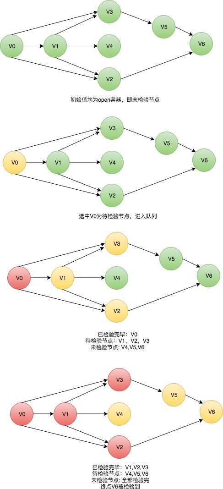
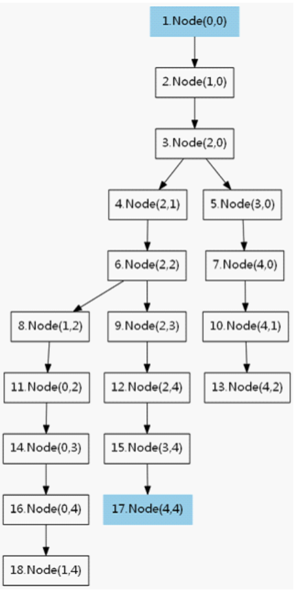

# BFS算法概述

## 1 概念

BFS 英文全称：Breadth-First-Search，广度优先搜索。

以下这段引用自百科：
BFS属于一种盲目搜寻，目的是系统的展开并检查图中的所有节点，以找寻结果。

## 2 算法中的三种节点状态
### 2.1 待检验的节点（展开节点下得到的子节点） 
该类节点会被存入一个先进先出的队列中
### 2.2 已被检验过的节点
该类节点会放入一个closed的容器中，比如说链表，队列等
### 2.3 未被检验的节点
该类节点会放入一个open的容器中，比如说链表，队列等

## 3 算法的实现逻辑
- 首先将根节点放入队列中
- 从队列中取出第一个节点，检验其是否为目标节点
	- 如果找到目标结果，则结束搜寻并回传结果
	- 否则展开该节点下的所有子节点加入队列中
- 若队列为空，表示整张图或树都检查过了，未命中目标节点，返回空值
- 重复第二步

## 4 算法图形基本思路

以下图用三种颜色来区分算法中三种节点的状态




## 5 迷宫算法题

### 5.1 题目描述
定义一个二维数组如下：
```
int maze[5][5] = {
		0, 1, 0, 0, 0,
		0, 1, 0, 1, 0,
		0, 0, 0, 0, 0,
		0, 1, 1, 1, 0,
		0, 0, 0, 1, 0,
};
```
它表示一个迷宫，其中的1表示墙壁，0表示可以走的路，只能横着走或竖着走，不能斜着走，要求编程序找出从左上角到右下角的最短路线。
### 5.2 解题思路

在该题目中，我们的节点就是`(x,y)`形式的.
起点Vs为`(0,0)`
终点Vd为`(4,4)`
队列集合为`Q={}`
初始化所有节点为open容器，即绿色节点

1. 起始节点Vs变成黄色，加入队列Q，Q={(0,0)}
2. 取出队列Q的头一个节点Vn，Vn={0,0}，Q={}
3. 把Vn={0,0}染成红色，取出Vn所有相邻的绿色节点{(1,0)}
4. 染成黄色，加入队列Q，Q={(1,0)}，不包含终点(4,4)
5. 取出队列Q的头一个节点Vn，Vn={1,0}，Q={}
6. 把Vn={1,0}染成红色，取出Vn所有相邻的绿色节点{(2,0)}
7. 染成黄色，加入队列Q，Q={(2,0)}，不包含终点(4,4)
8. 取出队列Q的头一个节点Vn，Vn={2,0}，Q={}
9. 把Vn={2,0}染成红色，取出Vn所有相邻的绿色节点{(2,1), (3,0)}
10. 染成黄色，加入队列Q，Q={(2,1), (3,0)}，不包含终点(4,4)
11. 取出队列Q的头一个节点Vn，Vn={2,1}，Q={(3,0)}
12. 把Vn={2,1}染成红色，取出Vn所有相邻的绿色节点{(2,2)}
13. 染成黄色，加入队列Q，Q={(3,0), (2,2)}，不包含终点(4,4)
14. 持续下去，知道Vn的所有相邻的白色节点中包含了(4,4)
15. 此时获得了答案

### 5.3 解题图示




### 5.4 解题代码

```
/**
 * 广度优先搜索
 * @param Vs 起点
 * @param Vd 终点
 */
bool BFS(Node& Vs, Node& Vd){
	queue<Node> Q;
	Node Vn, Vw;
	int i;
 
	//用于标记颜色当visit[i][j]==true时，说明节点访问过，也就是黑色
	bool visit[MAXL][MAXL];
 
	//四个方向
	int dir[][2] = {
		{0, 1}, {1, 0},
		{0, -1}, {-1, 0}
	};
 
	//初始状态将起点放进队列Q
	Q.push(Vs);
	visit[Vs.x][Vs.y] = true;//设置节点已经访问过了！
 
	while (!Q.empty()){//队列不为空，继续搜索！
		//取出队列的头Vn
		Vn = Q.front();
		Q.pop();
 
		for(i = 0; i < 4; ++i){
			Vw = Node(Vn.x+dir[i][0], Vn.y+dir[i][1]);//计算相邻节点
 
			if (Vw == Vd){//找到终点了！
				//把路径记录，这里没给出解法
				return true;//返回
			}
 
			if (isValid(Vw) && !visit[Vw.x][Vw.y]){
				//Vw是一个合法的节点并且为白色节点
				Q.push(Vw);//加入队列Q
				visit[Vw.x][Vw.y] = true;//设置节点颜色
			}
		}
	}
	return false;//无解
}
```

## 6 常见应用场景
1. 查找连接组件
2. 测试是否二分图
3. 应用于计算机游戏中平面网格
