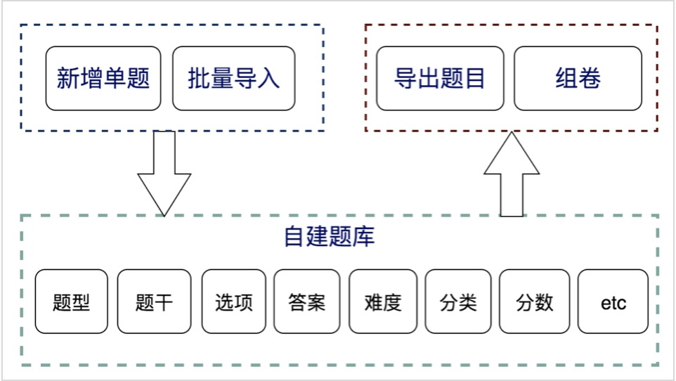
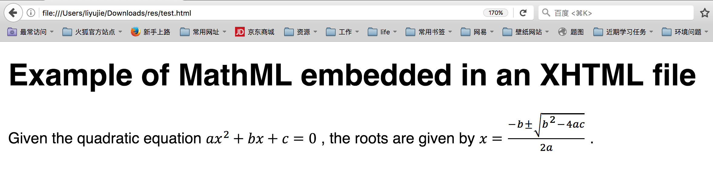

> 文章内容均是通过网络调研，自己部分实践来写的，不涉及任何绿色围墙信息。


## 1 背景 

针对题库的场景，与多家教育类公司进行过沟通，也在网上去看一些教研团队的反馈，整体来说确定以下三个关键点，面向的用户群体主要是教研类人员，包括老师、家教、助教等等角色。

- 将本地word文档导入成为一个个单题模式，达到统一存储、平台可视化
- 将平台上的单题进行勾选组合导出成本地word文档形式
- 将平台上的单题进行勾选组合生成网页套卷形式


## 2 产品架构图




## 3 关键实现点

整个产品流程中，最关键的几个点如下：

- 解析word文档 ，单纯解析不难，难点在于
	- 如何更精确更全面地解析word中每个元素（巨大的元素量）
	- 如何把解析到的元素映射成理想的格式
	- 如何处理word中的公式，使其具备较高还原度
	- 如何支持更多和更多变的word模板样式，对于模板兼容性的开发

- html形式的试卷如何导出成为docx，重点考虑点如下
	- 如何还原到排版较好的docx
	- 如何处理页眉页脚、内联、链接等等的word元素。这部分同解析类似，要处理巨多的页面元素
	- 如何处理页面公式，将公式还原成成docx中的展现


整个这些难点汇聚成一件事情，那就是word是一个很复杂的产物，word中的公式更是一个复杂、历史悠久的的产物。


接下来来聊聊word是什么，word公式悠久的历史，以及涉及到的各类名词。


## 4 走进Microsoft Word

### 4.1 Microsoft Word是什么

Word表象是什么，就不多说了，肉眼可见，是一个文字处理器应用程序，最早诞生于1983年。目前最新的版本为Word 2016 for Windows及Word 2016 for Mac。

附上维基百科的链接，可以详细阅读了解下发展历史：

https://zh.wikipedia.org/wiki/Microsoft_Word

不管Word发展了多少个版本，Word的后缀主要就是`.doc`和`.docx`两种。

接下来通过两者的区分点来认识下这两个后缀具体含义：

- 版本区别
	- Word 2003及以前的输出文档是.doc格式的
	- Word 2007及以后的输出文档是.docx格式的

- 形式区别
	- doc后缀本质是一个二进制文件，解析成本很高，主要是官方未做公开的规则说明。
	- docx后缀本质是一套压缩包，其中包括各类xml文件来指定存放的文本、字体、样式形式，其中document.xml 是核心内容xml文档。此处的x也是特指xml的意思，这个道理也可以迁移到xlsx，pptx等类型上。
	- word 2007是一个大的飞跃点，在这个版本支持了xml形式保存，同时新增了较多的特性，附上wiki链接：https://zh.wikipedia.org/wiki/Microsoft_Office_2007


### 4.2 公式的来历

先放结论：

Word 2003 引入mathType编辑器
Word 2007 支持OMML公式的编辑修改


先说说mathType，mathType是由一家公司独立编写的公式编辑器，当年word发现自身公式功能缺失，便和mathType公司协商，提供了一套简易的mathType给word进行了嵌入，很多年也未进行更新，直到2007版本，Word自己出了基于OMML的公式编辑，基于OMML的公式编辑，大大简化了公式的解析成本，也扩展公式的转换效率，如它的名字一般，更加open。


OMML是什么？下面会介绍到。在介绍OMML前，会先介绍OOXML。

个人理解，在定义上，二者可以独立
在实际的document.xml中，二者是包含关系。


### 4.3 OOXML

OOXML的全称为：Office Open XML。

建议先详细阅读以下两处链接内容：

https://zh.wikipedia.org/wiki/Office_Open_XML

[Office Open XML - Anatomy of an OOXML WordProcessingML File](http://officeopenxml.com/anatomyofOOXML.php)


这里说一些我理解的关键点

OOXML是一套微软开放的文档存储规范标准，它不仅仅针对word，而是针对所有07版本及以后的文档，包括pptx、xlsx、docx。

但是，不同的文档类型，ooxml的定义形式会有所不同。在本文中，我们重点了解下docx的xml定义，官方叫`WordprocessingML `


WordprocessingML的核心标签为：

- 段落标签 w:p
- 表格标签 w:tbl
- 文本标签 w:r
- sections标签 w:sectPr。这块不太好翻译，按官方的及时，更倾向于翻译成页面。因为xml中是不会定义页面这个版块，整个word文档都是由一个个的段落、内容、表格组成的。此时，word需要一个sections标签来定义页面宽高、页眉页脚等的信息

具体可以参见：

[Office Open XML (OOXML) - Word Processing - Sample .docx Document](http://officeopenxml.com/WPsampleDoc.php)


### 4.4 OMML


OMML这里就相对介绍简单一点，OMML正如上文提到的：

> 在定义上，与OOXML可以独立。在实际的document.xml中，二者是包含关系。

全称：Office Math Markup Language

OMML是office为了配合Office Open Xml制定的数学标记语言。

`a/b`的OMML表示法：

```
<m:oMath xmlns:m="http://schemas.openxmlformats.org/officeDocument/2006/math">
<m:f>
<m:num>
<m:r>
<m:t>a</m:t>
</m:r>
</m:num>
<m:den>
<m:r>
<m:t>b</m:t>
</m:r>
</m:den>
</m:f>
</m:oMath>
```


- [MathML and Ecma Math (OMML) – Murray Sargent: Math in Office](https://blogs.msdn.microsoft.com/murrays/2006/10/06/mathml-and-ecma-math-omml/)
- [OfficeMath – Murray Sargent: Math in Office](https://blogs.msdn.microsoft.com/murrays/2018/09/30/officemath/)


### 4.5 MathML


附上维基链接：

https://zh.wikipedia.org/wiki/%E6%95%B0%E5%AD%A6%E7%BD%AE%E6%A0%87%E8%AF%AD%E8%A8%80

确切的说MathML是W3C制定的一套描述数学符合和公式的标准，目标是把数学公式集成到万维网和其他文档中。


本地写一个test.html，内容如下：

```
<?xml version="1.0" encoding="UTF-8"?>
<!DOCTYPE html PUBLIC "-//W3C//DTD XHTML 1.1 plus MathML 2.0//EN" "http://www.w3.org/Math/DTD/mathml2/xhtml-math11-f.dtd">
<html xmlns="http://www.w3.org/1999/xhtml" xml:lang="en">
	<head>
		<meta http-equiv="content-type" content="text/html; charset=UTF-8" />
		<title>Example of MathML embedded in an XHTML file</title>
		<meta name="description" content="Example of MathML embedded in an XHTML file" />
		<meta name="keywords" content="Example of MathML embedded in an XHTML file" />
	</head>
	<body>
		<h1>Example of MathML embedded in an XHTML file</h1>
		<p>
			Given the quadratic equation
			<math xmlns="http://www.w3.org/1998/Math/MathML">
				<mrow>
					<mi>a</mi>
					<mo>&#x2062;</mo>
					<msup>
						<mi>x</mi>
						<mn>2</mn>
					</msup>
					<mo>+</mo>
					<mi>b</mi>
					<mo>&#x2062;</mo>
					<mi>x</mi>
					<mo>+</mo>
					<mi>c</mi>
					<mo>=</mo>
					<mi>0</mi>
				</mrow>
			</math>
			, the roots are given by
			<math xmlns="http://www.w3.org/1998/Math/MathML">
				<mrow>
					<mi>x</mi>
				<mo>=</mo>
					<mfrac>
						<mrow>
							<mo form="prefix">&#x2212;</mo>
							<mi>b</mi>
							<mo>&#x00B1;</mo>
							<msqrt>
								<msup>
									<mi>b</mi>
									<mn>2</mn>
								</msup>
								<mo>&#x2212;</mo>
								<mn>4</mn>
								<mo>&#x2062;</mo>
								<mi>a</mi>
								<mo>&#x2062;</mo>
								<mi>c</mi>
							</msqrt>
						</mrow>
						<mrow>
							<mn>2</mn>
							<mo>&#x2062;</mo>
							<mi>a</mi>
						</mrow>
					</mfrac>
				</mrow>
			</math>
			.
		</p>
	</body>
</html>
```


效果如下：




可以看出MathML整体的展现效果还是不错的，对于复杂公式的展现优于图片。

但是缺点也有，正如维基百科中说到的，支持的浏览器有限。摘抄如下：


> 在现在几个主要的网页浏览器中，基于Gecko的浏览器（如Firefox）有最完备的原生支持。[3][4]

> 而WebKit排版引擎有针对MathML的开发版，[5]这一特性只出现在Safari 5.1及更高版本、[6]Chrome 24，[7][8]但是不在后来的Chrome版本里面。[9]Google移除了MathML支持，宣称架构上的安全问题和低使用量不会证明他们的维护时间有理。[10]截至2013年10月年，WebKit/Safari的实现存在多个bug。[11]

> Opera 9.5—12支持MathML CSS配置，[12][13]但不能使附加符号正确放置。[14]9.5之前需要用户脚本或样式以模拟MathML支持。[15]从Opera 14开始，Opera通过迁移到Chromium 25引擎移除了MathML支持。[16]

> Internet Explorer原生不支持MathML。IE6到IE9在安装了MathPlayer插件后也可以识别MathML。[17]IE10使用MathPlayer时存在一些崩溃bug，并且微软决定在IE11完全禁止MathPlayer所需的二进制插件界面。[18]MathPlayer有协议条款会限制在商用页面或软件上面的使用或发行。使用或发行MathPlayer插件以通过商用软件中的WebBrowser控件显示HTML内容也有可能受到禁止。


### 4.6 LaTex

> LaTeX是各种TeX宏指令（每个指令由一系列TeX指令组成）的组合。严格说来，TeX是一套排版指令，是一套排版系统。LaTeX在设计时，更加强调了语义化的元素，比TeX的语义化强多了！然而，LaTeX在具体处理数学公式时，却仍然不能完全体现数学公式的语义，有很多命令更偏向于显示排版。一言以蔽之，LaTeX有语义化的成分，但“语义”得不够彻底。

简而言之，公式排版系统。

应用场景非常广泛，编辑效率高、展示效果好。


链接：[LaTeX - A document preparation system](https://www.latex-project.org/)


### 4.7 MathJax

链接：https://zh.wikipedia.org/wiki/MathJax

MathJax 的几个关键点如下：

- JaveScript库
- 可以将LaTeX Code和MathML源码转成兼容性更好的Html
- 支持通过MathJax Html源码转成Latex或者MathML
- 浏览器兼容性较高，大部分的浏览器都可以覆盖
- MathJax可以通过MathJax-node库在NodeJS中使用


## 5 数据转化流程


## 6 效果展示
 待补充

## 7 小工具

### 7.1  利用MathJax将latex或mathml渲染为可视化html

示例：`$ \mathrm{y}=\mathrm{lg}\frac{x}{x-2}+\mathit{arcsin}\frac{x}{3}$`

[MathJax | Beautiful math in all browsers.](https://www.mathjax.org/#demo)


### 7.2 公式与Latex Code互转工具

输入示例：`x+sin(x) = 1`

[MathLex - LaTeX Utility](http://mathlex.org/latex)


### 7.3 LaTex Code生成图片

输入示例：`$ \mathrm{y}=\mathrm{lg}\frac{x}{x-2}+\mathit{arcsin}\frac{x}{3}$`

[drawLaTex](http://leeenx.github.io/drawLaTex/latex.html)

