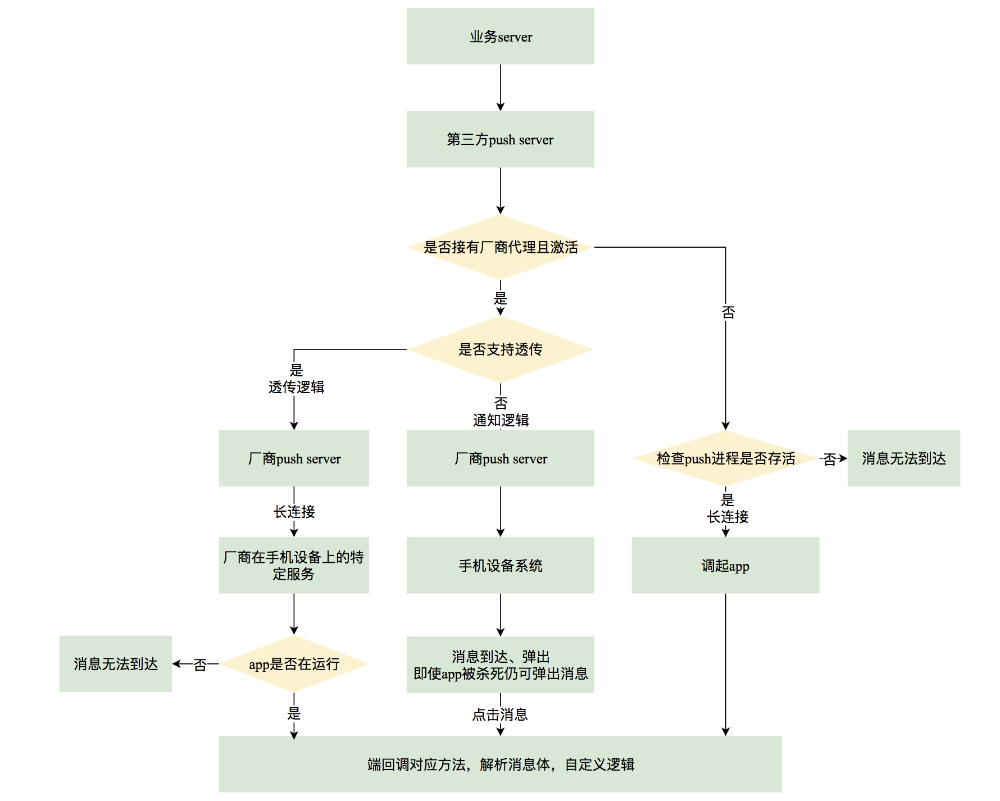

> 近期在设计app push服务的整体迁移，之前对这块了解比较少，借着这个项目对push服务做了下整体的梳理，在这里就基本的知识点和一些技术实现做下总结和探讨。

## 1 什么是App push
不做过多解释了，就是我们日常看到的app推送消息，通常出现在通知栏、手机锁屏屏幕。
目的就是通过引人入胜的标题，来吸引用户的点击，进而增加日活、流量以及留存等。

## 2 推送通道类型
* 厂商通道
* 第三方推送服务
* app自身长连接推送

### 2.1 厂商通道
厂商通道如名字所述，厂商有自己的服务器和对应的SDK，端内通过接入SDK来与厂商server建立连接，进行推送。
目前安卓的厂商通道主要是华为、小米、vivo、oppo等，ios的就比较统一，统一走苹果自己的厂商代理。

使用厂商通报的到达率会比较高，因为它不依赖用户对于app是否kill这个点。

### 2.2 第三方推送服务
大一点的第三方推送平台：个推、信鸽、BAT推送服务等。

这种一般就是某类专门的公司独立搭建一整套消息推送服务，包括客户端SDK、推送任务配置、用户上报、消息推送server、数据统计等一整套完善服务，上游业务只要接入SDK即可。

当手机上多个app使用同一个推送平台服务时，客户端集成的其实是一套SDK，同一设备上多App共享一个长连接，由当前设备上的最高优先级App维持连接和消息分发。但随着Android后台限制及厂商ROM限制，共享机制会影响Push到达率（如A维持长连接，无法给B分发消息）。同时，应用间跨进程通信也存在PR风险（如在VIVO上会提示XXX尝试启动XXX）。
因此很多第三方推送切换为应用独立长连接，每个应用有独立的push进程维持自己的连接，避免Push分发折损，提升到达率。

### 2.3 app自身长连接服务

这个思路就比较简单了，等于是自建一套从业务server到业务端的长连接。
但是实现成本较高，投入的研发人力会比较大，并且到达率和稳定性一般是没有厂商通道和第三方稳定的。

## 3 推送消息类型

### 3.1 透传消息

透传消息：透明传输消息。消息体的格式及内容通道不去过问，通道只传递消息，对消息不做处理；客户端收到消息后，由客户端决定如何处理消息（消息体可以是自定义消息体）。

*接收push依赖 应用 存活。*

### 3.2 通知消息

通知消息：通知栏消息是直接展示出来，相关的动作客户端无法捕获到（消息体为固定的消息格式）

*接收push不依赖 应用存活。*

### 3.3 双通道文本消息

这里说下，一般三方推送服务为了提升到达率都会集成各大厂商的SDK进行推送，所以会出现厂商通道+三方通道结合的消息类型，即为双通道文本消息，主要目的就是提高push到达率所设计的一种包括透传和通知的消息格式。

## 4 推送范围
* 单播
	* 推送给某个人
* 组播
	* 推送给指定的标签的一批设备
* 广播
	* 向当前app下所有设备推送一条消息
* 批量单播
	* 推送消息给批量设备

## 5 整体推送架构图

针对以上的推送，用一个数据流图来做下整体的串联，加深理解。

