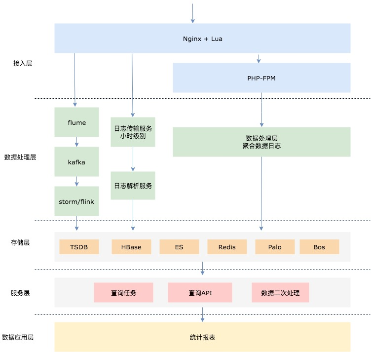

> 几个问题
> 1. 为什么需要设备上报
> 2. 那么什么是设备token，为什么需要记录
> 3. 如何在推送时精准的找到要推送你的app而不是别人的

上面的问题，总结一下就是：

我们在做推送时，首先要找到设备，紧接着找到该设备上的app。每一个设备都有自己的设备号，而设备中的app（也可能是三方app）又都有一个唯一的包名，deviceToken就是这有意思，它标识了push该怎么发。
之前提到过推送的范围，包括广播、组播、单播、批量单播这些形式，那么到底层实际推送时，必然是通过设备上报，维护一个设备的池子，不过上报+存储+广播/组播+统计这几件事情，很多三方平台已经做了，也有一些三方平台自身不稳定等，导致业务需要自己去维护这样的一个设备池子。

其实不仅仅是在app push这个场景中会有这样的需求，包括现在比较火的物联网，也都会有设备上报这个需求，不同业务的特点也会有所不同，列举下app push这个场景的几个特点
* 高并发
	* 尤其是集中在广播push后，比如说提醒用户签到。设想推送的百日联网设备有1000万，即使我设计了分批推送，100万一批，点击的用户占5%，那也有5万的用户会批量上报
* 设备数据统计低延时
	*  比如说上午启动的用户，我期望下午就可以收到来自app的推送
* 中大型数据存储
	* 支撑中大型app百日联网app设备量

## 1 功能概述
针对这类问题，整体的功能抽象拆分如下，以下思路也适合很多场景，包括埋点统计等

* 数据采集/交互
* 数据处理
* 数据应用

### 1.1 数据采集

如何做设备上报的采集，即做成一个设备的池子。
说下之前遗留的做法，直接写在启动时的业务接口中，每次上报其实是一次写mysql写redis的操作，最开始写mysql直接导致数据库扛不住压力崩了，写redis的话无法直观的看到数据表象，且维护和获取成本较高。

合理的数据采集还是走请求落日志形式，也是业界通用的做法，充分利用了Nginx的高性能，access_log日志是顺序写入，本身也很快。用ab工具测试单机Nginx（2核8G）的qps能到3万。

落盘的日志，需要进行处理，不管什么样的数据处理方式，首要就是传输，开源的数据传输服务也很多
Logstash、flume等配合kafka的传输是比较通用的，当然也有很多像阿里、腾讯等一些专业公司或者大公司封装的实时数据流处理方案，包含了这一整套的，附录里我会列出来供后续学习。

### 1.2 数据处理

数据处理这块，从技术的发展历程来看，笼统理解如下：
* 传统数据处理
	* shell命令脚本
	* python脚本等入库
	* 数据量小
* 大数据离线计算(非实时)
	* Hadoop
	* MapReduce
	* 离线仓库
* 服务端流式计算
	* Flink
	* SparkSreaming
	* Storm
	
### 1.3 数据应用

这个点就比较自由了，应用于设备上报、实时统计打点、日志报警等多种场景下都是可行的，当然数据也可以根据实际情况存于mysql\redis等

## 2 数据流图

