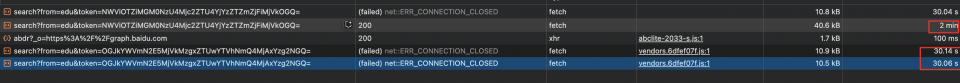
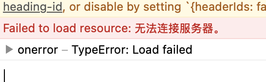
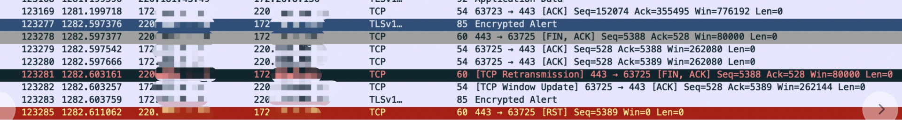

接入大模型流式接口时遇到超时问题，在这里mark下

### 问题表现
服务器通过Server-Sent Events向浏览器推送信息时，浏览器先后报错『Load Failed』『net::ERR_CONNECTION_CLOSED』，看起来是超时或者连接断开的表现

### 排查思路

* 起初超时问题表现的报错是『浏览器下接口响应超过30-50s』就会报错『Load Failed』，稳定复现，看起来是一个超时的问题
后端同学反馈，后端自测接口是没有超时问题的，但是通过前端浏览器就会报错，所以倾向于前端有问题，但是相信做过server的同学对于超时问题都会首先怀疑服务端，这一步排查思路还是清晰的，主要是看下『后端自测的接口』 和 『通过浏览器访问的接口』在访问形式上找不同，发现前端的访问接口，是通过线上域名携带cookie的形式转发到了proxy机器，进而转发到后端机器，这部分其实是比后端自测多经过了两步VIP、Nginx的转发
* 排查Nginx的超时配置，发现写响应超时配置确实只有50s，将写响应超时配置改成120s，再次进行回归，发现变成了不稳定复现超时，并且基本都是30s超时
* 与负责VIP的同事沟通，提到VIP对响应超时的配置非常宽松，不会成为卡点
* 这时的排查思路还聚焦在Http层，继续①通过curl、postman、charles等工具对域名进行超时测试 ②自查各路由层超时配置 ③与不超时的流式接口对比http协议头内容
* 与不超时的接口对比，发现http请求协议头没有包括Connection:keep-alive，通过charles转发时，配置header头增加Connection:keep-alive，发现可以解决超时问题
* 但是线上接口上线后，通过浏览器回归疑似仍有这个问题
* 至此http层面已经排查不出更多，只能通过wireshark抓包，看TCP协议是在哪里断开的，发现是如图所示，服务端主动断开了连接（220向170发出了断开连接），SSL通信在断开连接时均为发送Encrypted Alert信息给客户端告知要关闭ssl会话了，同步会发生FIN,ACK报文从TCP层面断开链接

* 说明问题还是在服务端，此时求助域名侧的同学，发现该域名的协议配置为：h2;rate=100,spdy/3.1;rate=100,http/1.1，包括了h2和spdy的高级协议，把这两个协议去除后问题解决

至此通过以下三个手段解决了问题，但是留给我们思考的点还很多

* 调整Nginx超时配置
* 增加keep-alive Header头
* 去除域名高级协议

### 一些思考

1）keep-alive是否在http1.1自动生效，如果自动生效还是否有增加的必要性？

官方说明http1.1支持Keep-Alive，但是考虑到后端的路由复杂，存在集群间的调用，通过显式添加 Connection: Keep-Alive ，可以避免『存在服务器或中间件的默认超时限制』

2）http高级协议是否会对超时造成影响，这些协议和Connection: Keep-Alive的关系是什么？

这块其实依然有困惑，能明确的是，在厂内的http2.0和spdy协议，无法显式的增加Connection：keep-alive，猜测大概率和这部分协议的超时配置有关
